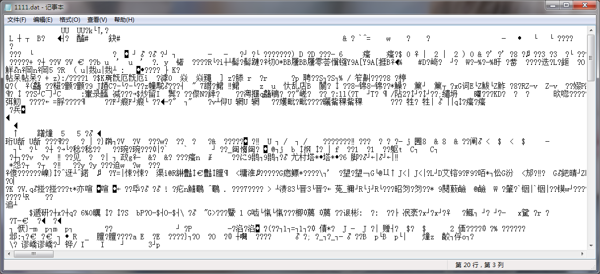
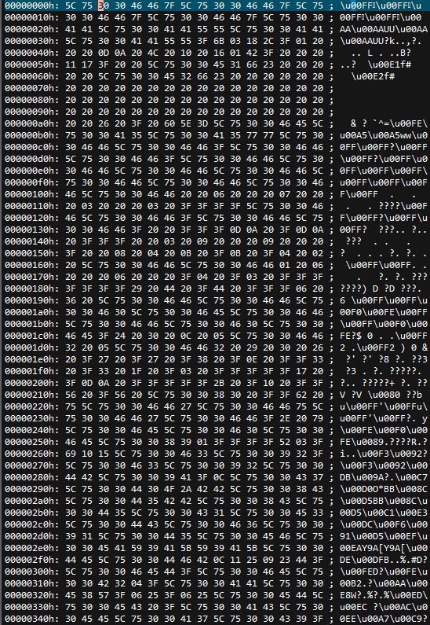

在数据处理过程中，有时候会经常产生dat文件来保存数据，由于dat文件是数据保存文件，因此常常是加密存在的，打开以后会出现乱码的情况，如图1所示。一般可以通过UltraEdit来查看其二进制代码，如图2所示。那么，如何通过matlab实现这种格式的转换并输出呢？



<center>图1 乱码文件</center>



<center>图2 乱码文件16进制形式</center>

# 文件读取

首先，我们以“按行读取”的形式读取dat文件，matlab提供函数`fgetl`来读取文件里的一行数据，我们只需要循环调用此函数，然后将其存储到变量里面，知道文件结束即可。整个matlab代码如下：

```matlab
%打开文件
fid1 = fopen('1111.dat','r');    %以只读的形式打开文件
x{1} = fgetl(fid1);              %获取文件的一行数据
len = 1;                         %获取行数                          
while ischar(x{len})             %判断文件是否结束
    len = len+1;                 %行数加1
    x{len} = fgetl(fid1);        %获取一行数据
end
fclose(fid1);                    %关闭文件

%x最后一行包含文件结束符。需要去除
x{len} = [];
len = len-1;
```

**注意**：文件打开，在文件使用完毕之后，一定要使用`fclose`函数关闭文件。另外，由于循环一直读取了文件结束的最后一个字符，因此，需要把文件结束符去掉。

# 格式转换

在读取了一行数据之后，利用函数`unicode2native`将字符串的编码由unicode转变为本地系统编码，即十进制代码，然后通过函数`dec2hex`将十进制编码转换为16进制编码。代码如下：

```matlab
for i=1:len
    x_base10 = unicode2native(x{i});        %将其按照unicode格式进行解释得到编码数据
    x_base16{i} = dec2hex(x_base10);        %将数据转换成16进制数字，以字符数组形式存储        
end
```

但是需要注意的是，**此时16进制数据是以行的形式**存储在cell元里面。我们需要将其转换成一个字符矩阵。每行是一个16进制数据。在matlab中观察`x_base16`数据的样式，如图3所示，可见，cell元里面的每个元素都是一个$$ n \times 2 $$的矩阵，该矩阵的每一行都是一个16进制数据。


<center>图3 cell元素示例</center>

因此，我们只需要将cell里的每个元素竖直的拼接在一起即可。matlab正好提供了函数`strvcat`实现这些功能，我们只需要循环调用即可，代码如下：

```matlab
data_base16 = strvcat(x_base16{1},x_base16{2});         %将字符数组前两行以垂直方式拼接
for j=3:length(x_base16)
    data_base16 = strvcat(data_base16, x_base16{j});    %将字符数组后面的每行依次拼接到新数组
end
data_base16 = cellstr(data_base16);                     %将其转换为字符串单元组
```

# 文件存储

`data_base16`是最后处理完的数据，最后将其保存即可。可以通过`w`方式打开文件，`fprintf`函数循环写入，或者直接从变量区复制粘贴都可以。这里就不再啰嗦说明了。


PS：最后，16进制数据读取出来了，破解的事就交给大家了。哈哈